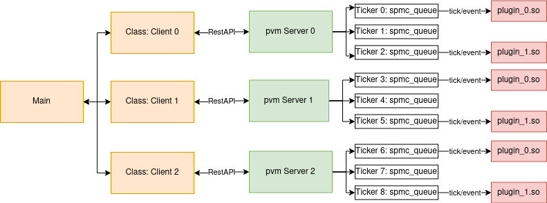

# pvm_cpp

My personal [pvm](https://en.wikipedia.org/wiki/Parallel_Virtual_Machine)-like playground combined with an exploration of different HFT programming techniques.

The structure of the system is a network of machines / processes which can be controlled through a RestAPI to load data and be passed plugin-like dynamic libraries with functions to be executed on the loaded data.
The main observation to be explored is that it is easier/cheaper/faster to pass code around rather than data, i.e. that the different pvm instances can load their local data and receive the code to be ran on that data.

The design is shown in the graph below.

# Build
`bazel` is used as the build framework.
The code can be ran by running first `bazel build //plugins/0:plugin_0` to build an example plugin followed by `bazel run //src:main` to build the main executable.
Use `bazel <build/run> -c opt` for an optimized build.
The executable can then be found in `bazel-bin/pvm_cpp/main`.
Change `src/main.cpp` according to your setup.

To run the benchmark of the `spmc_queue` performance you can run `bazel run -c opt //benchmarks:spmc_queue`.

# Internals

## SPMCQueue

This is essentiall a ring buffer with a single producer and multiple consumers of the data.
It uses `SeqLocks` so the single writer is not impacted by the amount of readers.
Inspiration was taken from [David Gross' talk](https://www.youtube.com/watch?v=8uAW5FQtcvE).

## DataSet

A `DataSet` holds tick values for one ticker, with an `SPMCQueue` for newly incoming ticks, and a `vector` storing all ticks.
It can be loaded and stored by a `Server`, and is used as the input argument to functions defined by plugins.

## Server

A `Server` handles restAPI requests to load `DataSets`, add new `Ticks` to existing `DataSets` and load and execute `Plugin` code.

## Plugins

`Plugins` are compiled .so library files that hold some functions through which the `Server` can interact with it.
Notably `init`, `run` and `finalize`. A `Server` can load a new plugin and start executing it on existing or newly available `Ticks` in a given `DataSet`.
This allows for modularity and data locality, i.e. we ship around the .so files which are small rather than the enormous amounts of data.

